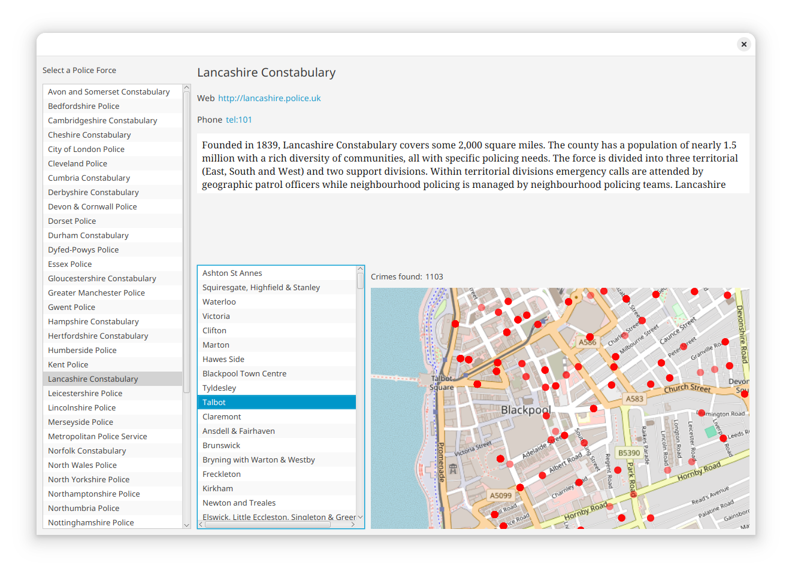

UK Crime JavaFX
===============

This project demonstrates how to use JavaFX on modern Java (JDK 11 and above). It makes use of the UK Police API to view information about various police forces and shows locations of recent crimes using a map view.

### Build and Run the application

Clone the project and run using the latest version of Maven and JDK 11: `mvn install` then `mvn javafx:run -pl javafx-app`
